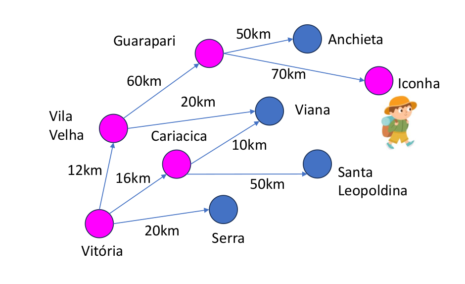

# Busca em grafos
Este projeto implementa os algoritmos de busca em grafos DFS (Depth-First Search), BFS (Breadth-First Search), UCS (Uniform Cost Search) e A* para encontrar o caminho entre duas cidades em um grafo.



## Descrição e contexto

Leopoldo ama viajar e conhecer lugares, mas não possui um mapa nem um celular. Para tentar chegar em um local objetivo (por exemplo, Iconha), sempre que ele chega em uma nova cidade, ele pergunta para os moradores quais são as cidades vizinhas e a distância para estas cidades. A depender do algoritmo selecionado para fazer a busca no grafo, ele escolhe uma cidade dentre as possibilidades para visitar. Leopoldo repete o processo até chegar no objetivo.

Este projeto foi desenvolvido como parte da disciplina de Estruturas de Dados na Universidade Federal do Espírito Santo (UFES). O objetivo é explorar e implementar as seguintes estruturas de dados e algoritmos:

- Heap: Para a implementação eficiente de algoritmos de busca que requerem a extração do menor custo.
- Deque: Para a implementação de busca em largura (BFS) e busca em profundidade (DFS).
- DFS (Depth-First Search): Um algoritmo que explora o máximo possível em cada ramificação antes de retroceder.
- BFS (Breadth-First Search): Um algoritmo que explora todos os nós no nível atual antes de passar para o próximo nível.
- UCS (Uniform Cost Search): Um algoritmo que expande o nó com o menor custo até a cidade de origem.
- A*: Um algoritmo que usa o custo de uma cidade até a origem e uma função heurística para estimar o custo total até o objetivo e encontrar o caminho mais eficiente.

## Requisitos

- Compilador C (ex: GCC)
- Terminal

## Como rodar

- Caso já tenha o GCC (compilador C) instalado, basta seguir o passo-a-passo abaixo:

1. Clone o repositório:
   ```bash
   git clone https://github.com/AlvaroAntunes/work-data-structure.git

2. Navegue até o diretório do projeto:
    ```bash
    cd work-data-structure

3. Compile:
    ```bash
    make

4. Execute:
   ```bash
   make run
   OBS: Utilize o nome do arquivo das cidades como entrada no terminal.
   Exemplo: Após executar o make run, digite: ../test_cases/01_astar_input.txt no terminal.


